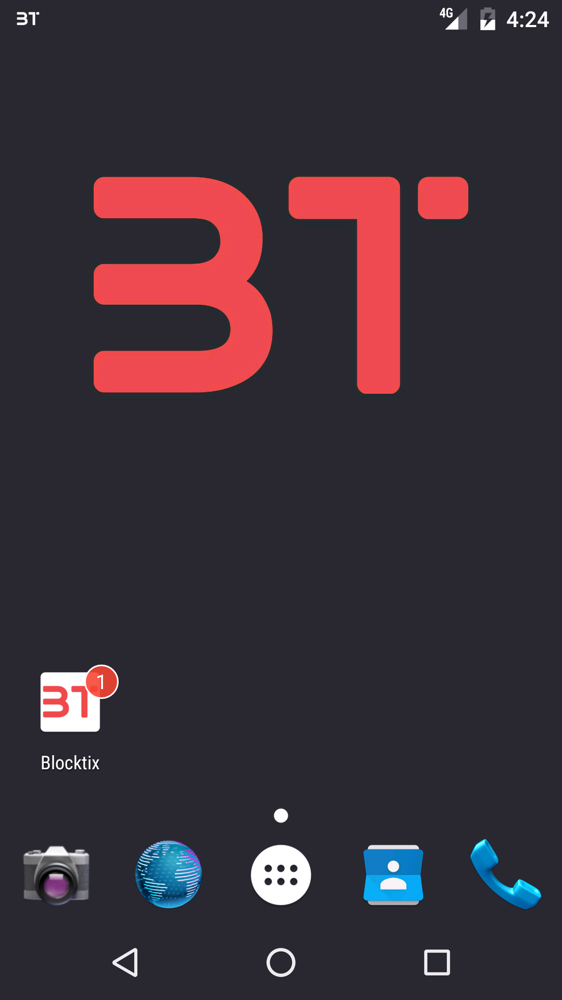
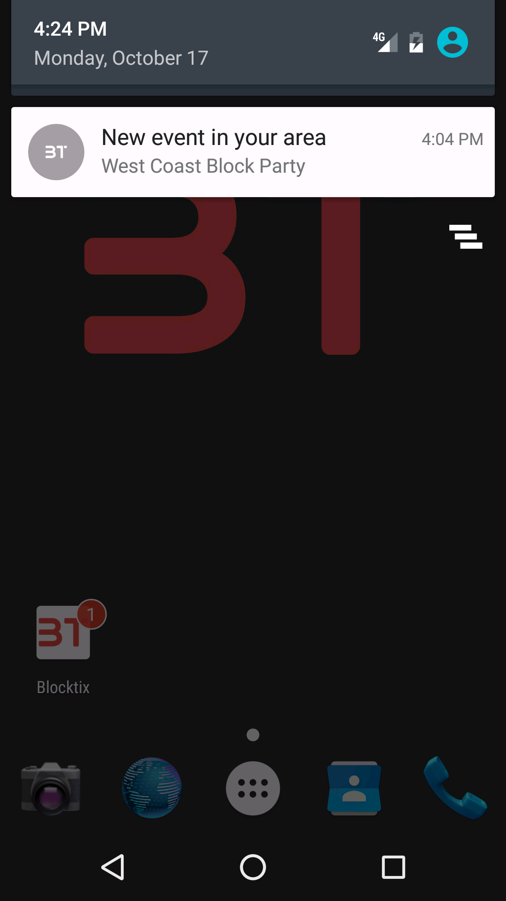
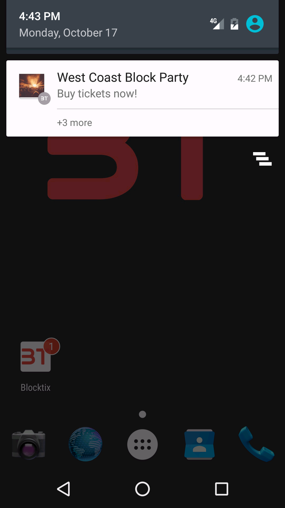

Blocktix Android Starter
========================

What the title says, the start of the android app, nothing more... We just have a notification in it - promotional purposes for now.

Pre-requisites
--------------

- Android SDK 24
- Android Build Tools v24.0.3
- Android Support Repository

Screenshots
-------------
 icon|basic|expanded
:-:|:-:|:-:
||

Getting Started
---------------
This starter uses the Gradle build system. To build this project, use the
"gradlew build" command or use "Import Project" in Android Studio.
